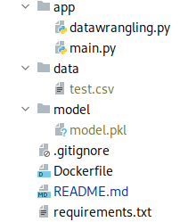
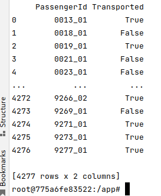

# Datapath ML
repositorio para proyecto de clase de machine learning

> **Estructura del proyecto**



**Nota:** el folder `data` y `model` no se les hace commit pero al momento de la creación de la imagen el folder `data` se crea en el Dockerfile porque este se va a usar para pasar el archivo `test.csv` para el modelo y el folder `model` si debe contener nuestro modelo creado ***Si requiere el modelo por favor ponerse en contacto conmigo.***  

> #### Ejecución de la imagen
>Para la ejecución de esta imagen se hace por medio de comandos docker
> ```niginx
> docker build -t <nombre para la imagen> .
> docker images
>```
> Una vez construida la imagen se puede crear el contenedor
> ```nginx
> docker run --name <nombre para el contenedor> -d <nombre de la imagen>:<version>
> docker ps
>```
> Ya se debería ver el contenedor ejecutandose
> luego vamos a pasar nuestro archivo `test.csv` que requiere el modelo
> ```nginx
> docker cp <ruta origen> <contenedor>:<ruta destino>
>```
> Ejemplo:  `docker cp data/test.csv test:/app/data`
> 
> Luego ingresamos al contenedor y vamos a ejecutar nuestro modelo
> ```nginx
>  docker exec -ti <contenedor> bash
>```
> desde el contenedor ejecutamos
> ```nginx
>   python app/main.py test.csv
>```
> y se debería tener una salida de este tipo
>
> 
> 
> Para Salir del contenedor con la combinación de teclas `Ctrl + d` nos salimos y para detener el contenedor solamente ejecutamos
> ```nginx
>  docker stop <contenedor>
>```

#### ¡Buen viaje!